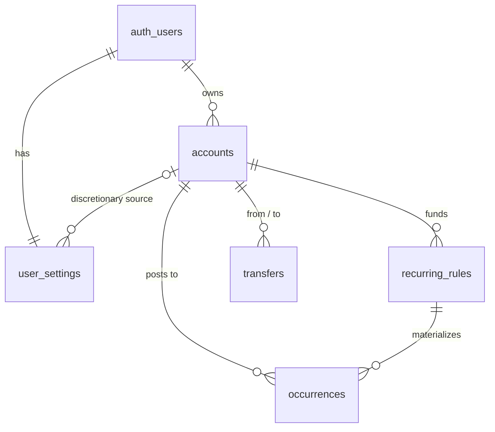

# Database — core domain schema

This document describes the five tables issue #3 added to `public`:
`accounts`, `recurring_rules`, `occurrences`, `transfers`, `user_settings`.
`shared/supabase/database.types.ts` is **generated** from this schema by
`bun run db:types` — this file is the description, that file is the source of
truth for TypeScript. If they disagree, regenerate the types; never hand-edit
them.

The migration is `supabase/migrations/<timestamp>_core_domain_schema.sql`. The
RLS pattern it follows is documented once, canonically, in
[`rls.md`](./rls.md) — this document does not repeat it.

## Entity diagram



`auth_users` is Supabase's `auth.users` — the underscore stands in for the dot
because mermaid treats `.` as a relationship separator.

## Tables

### `accounts`

| column | type | notes |
|---|---|---|
| `id` | `uuid` | PK |
| `user_id` | `uuid` | FK → `auth.users`, cascade delete |
| `name` | `text` | 1–80 chars, trimmed |
| `color` | `text` | `chart-2` / `chart-3` / `chart-4` — a design-token slot, `text` + `check` rather than an enum because the palette can churn. `chart-1` (combined line) and `chart-5` (what-if tint) are never assignable. Mirrors `domain/types.ts` `ACCOUNT_COLORS`. |
| `balance_cents` | `bigint` | signed — an overdrawn account is a real reading |
| `balance_as_of` | `date` | the anchor the projection engine runs forward from |

`unique (user_id, id)` is the anchor every child table's composite foreign key
references — see [Cross-user integrity](#cross-user-integrity-composite-foreign-keys)
below. It also serves as the RLS-predicate index, so no separate
`accounts_user_id_idx` exists.

### `recurring_rules`

| column | type | notes |
|---|---|---|
| `id` | `uuid` | PK |
| `user_id`, `account_id` | `uuid` | composite FK → `accounts (user_id, id)`, cascade delete |
| `name` | `text` | 1–80 chars |
| `kind` | `recurring_kind` enum | `bill` \| `income` |
| `amount_cents` | `bigint` | always a positive magnitude; the sign is derived from `kind` when an occurrence is materialized |
| `amount_source` | `recurring_amount_source` enum | `fixed` \| `predicted` — `predicted` is income-only |
| `is_variable` | `boolean` | bill-only presentation marker (a utility bill); the stored amount is still what projection uses |
| `cadence` | `recurring_cadence` enum | `weekly` \| `biweekly` \| `monthly` \| `annual` |
| `anchor_date` | `date` | the single source of cadence alignment — weekday for weekly/biweekly, day-of-month for monthly, month+day for annual |
| `starts_on`, `ends_on` | `date`, nullable | inclusive window bounds; `null` = unbounded in that direction |

Deleting the account a rule belongs to cascades to the rule, and from there to
its occurrences — see [Deletion cascades](#deletion-cascades).

**Cadence is enum + anchor, nothing else.** There is no `day_of_month`,
`interval_count`, or `weekday` column. Every column that isn't added is a
combination that can't contradict another (`weekly` with `day_of_month = 15`,
for instance). This is deliberately not a general-purpose RRULE engine — "the
2nd Tuesday of the month" is out of scope, by the issue's own words.

### `occurrences`

| column | type | notes |
|---|---|---|
| `id` | `uuid` | PK |
| `user_id`, `account_id` | `uuid` | composite FK → `accounts (user_id, id)`, cascade delete. Denormalized from the rule so the projection index needs no join. |
| `user_id`, `rule_id`, `account_id` | `uuid` | composite FK → `recurring_rules (user_id, id, account_id)`, cascade delete. Includes `account_id` so the denormalized copy cannot disagree with its source — see [Why the rule FK carries account_id](#why-the-rule-fk-carries-account_id) |
| `projected_date` | `date` | written by generation, never by a user — see [The regeneration contract](#the-regeneration-contract) |
| `projected_amount_cents` | `bigint` | signed: income positive, bills negative |
| `actual_date`, `actual_amount_cents` | `date`, `bigint`, both nullable | supersede the projection once the user edits this instance or it happens; a null `actual_date` means "on `projected_date`" |
| `status` | `occurrence_status` enum | `projected` \| `confirmed` \| `skipped` |
| `is_overridden` | `boolean` | true once a single-instance edit has been applied |

`unique (rule_id, projected_date)` is the natural key regeneration upserts on.

### `transfers`

| column | type | notes |
|---|---|---|
| `id` | `uuid` | PK |
| `user_id`, `from_account_id` / `to_account_id` | `uuid` | composite FKs → `accounts (user_id, id)`, cascade delete |
| `amount_cents` | `bigint` | positive; `check` rejects `<= 0` |
| `occurs_on` | `date` | |

`from_account_id <> to_account_id` is a `check` constraint. One row, one
positive amount — see [One row, not two legs](#one-row-not-two-legs).

### `user_settings`

| column | type | notes |
|---|---|---|
| `user_id` | `uuid` | PK **and** FK → `auth.users`, cascade delete — one row per user, structurally |
| `cushion_cents` | `bigint` | default `60000` |
| `monthly_discretionary_cents` | `bigint` | default `0` |
| `discretionary_account_id` | `uuid`, nullable | composite FK → `accounts (user_id, id)`, `on delete set null (discretionary_account_id)` — deleting the account nulls only this column, never `user_id` |
| `default_horizon_days` | `smallint` | `30` \| `60` \| `90`, matching the dashboard's horizon toggle |

`user_id` being the primary key is itself the RLS-predicate index — no
separate `user_settings_user_id_idx`.

## Design decisions

### Cross-user integrity: composite foreign keys

A plain `references accounts (id)` foreign key is checked as the table owner
and therefore bypasses RLS: user A could insert a rule pointing at user B's
account, and no policy would ever see it happen, because the row is never
read back through a policy-governed role during the check. That is a real
hole against "cross-user access impossible at the data layer."

The fix here: every parent table carries `unique (user_id, id)`, and every
child's foreign key is `foreign key (user_id, child_fk) references parent
(user_id, id)`. Planting a row with `user_id = B` but pointing at an account
owned by A is now a foreign-key violation, not merely a policy denial —
provably so, even from a connection that holds `BYPASSRLS`. See
`tests/rls/domain-tables.test.ts`'s last describe block.

Cost: one extra unique index per parent table, which doubles as its
RLS-predicate index rather than sitting alongside a separate one.

### Why the rule FK carries `account_id`

`occurrences.account_id` is denormalized from the owning rule so the projection
index can be `(user_id, account_id, projected_date)` without a join. A copied
value can drift from its source, so the foreign key includes it:
`(user_id, rule_id, account_id)` references
`recurring_rules (user_id, id, account_id)`, backed by a matching unique key on
the parent.

Without it, reassigning a rule to another account — an ordinary edit — would
leave every existing occurrence pointing at the old account with no error, and
the projection would bill the wrong account while the rule read correctly. With
it, that reassignment is rejected while occurrences exist. Moving a rule between
accounts is a rule split, the same shape as apply-to-future: close the old rule,
open a new one on the new account.

This is the schema's general stance — an invariant a reader has to remember is
not an invariant. Everything else here is structural, and the one denormalized
value is too.

### One row, not two legs

A transfer is one row — `from_account_id`, `to_account_id`, one positive
`amount_cents` — rather than a parent row plus two signed leg rows. Net-zero
is structural: there is exactly one amount, and the two legs are derived from
it at read time. "Exactly two legs that sum to zero" is not expressible as a
table constraint on a two-row design without a deferred constraint or a
trigger, and is violable between statements even then.

`domain/types.ts`'s `Transfer` made the same call, for the same reason — "the
pair can never drift apart." If a leg ever needs independent state (one side
cleared, the other still pending), that is reconciliation, and it is out of
scope here.

### The regeneration contract

`projected_date` is written by the occurrence generator and never by a user.
That is what makes `(rule_id, projected_date)` a stable natural key even when
a user retimes an occurrence — a retime writes `actual_date`, leaving the key
untouched.

**A row is protected iff `is_overridden` or `status <> 'projected'`.**
Regeneration (issue #9) upserts on `(rule_id, projected_date)`:

```sql
insert into public.occurrences (user_id, account_id, rule_id, projected_date, projected_amount_cents)
values (...)
on conflict on constraint occurrences_rule_projected_date_key
do update set
  projected_amount_cents = excluded.projected_amount_cents
where not occurrences.is_overridden and occurrences.status = 'projected';
```

Deleting now-out-of-window rows (a rule's window shrank) uses the same
predicate, so a protected row is never silently removed either.

### Rule splitting

Apply-to-future is implemented as a **rule split**: close the existing rule
with `ends_on`, open a new rule at `starts_on`. Occurrence rows are never
bulk-updated — that would lose history and break reconciliation between what
was projected and what a confirmed occurrence actually recorded.

Worked example, from the seed: the Rent rule was `$1,650/mo` through August,
raised to `$1,750/mo` from September on.

| rule | `anchor_date` | `starts_on` | `ends_on` | occurrences produced |
|---|---|---|---|---|
| Rent (closed) | `2026-08-01` | `null` | `2026-08-31` | `2026-08-01` only |
| Rent (new) | `2026-09-01` | `2026-09-01` | `null` | `2026-09-01`, `2026-10-01`, `2026-11-01`, … |

`starts_on` on the new rule equals its `anchor_date` — the window opens
exactly on-cadence, so no partial-month occurrence is produced at the seam.
`domain/cadence.ts` `occurrenceDates` clamps its walk to
`[max(start, startsOn), min(end, endsOn)]` before expanding, so the two rules'
outputs are contiguous and non-overlapping across the split date —
`domain/cadence.test.ts` asserts the exact array on both sides.

### Deletion cascades

Deleting an account cascades to its rules, and from there to its occurrences
— including confirmed ones. This is a deliberate default, not an oversight:
an account that no longer exists cannot fund a rule, and a rule that no
longer exists cannot own an occurrence. There is no soft-delete or archive
path in this issue; if losing confirmed history on account deletion turns out
to be the wrong default, that is a later decision, not a silent one made here.

### Domain mapping

The table `domain/*` code should consult when wiring a store to this schema:

| domain | column | note |
|---|---|---|
| `Account.balance` | `accounts.balance_cents` | |
| `Account.isDiscretionarySource` | *derived* | `user_settings.discretionary_account_id = accounts.id` |
| `RecurringItem.nextOccurrence` | `recurring_rules.anchor_date` | **names differ deliberately**: the domain expands in both directions from it, so it is an anchor, not a "next" |
| `RecurringItem.depositHistory` | *derived* | `occurrences.actual_amount_cents where status = 'confirmed'`, ordered by `projected_date`. No array column — this is why occurrences are materialized |
| `Transfer.date` | `transfers.occurs_on` | |
| `Transfer.createdAt` | `transfers.created_at` | epoch ms at the mapping edge; only ever a same-day tie-breaker |
| `RunwayData.safetyCushion` | `user_settings.cushion_cents` | |
| `RunwayData.dailyDiscretionarySpend` | *derived* | `dailyFromMonthly(monthly_discretionary_cents)` — see `domain/discretionary.ts` |
| `Occurrence.date` / `.amount` | *derived* | `coalesce(actual_*, projected_*)` |
| `OccurrenceOverride` scope `once` | `actual_*` + `is_overridden = true` | |
| `OccurrenceOverride` scope `future` | **a rule split**, not an occurrence write | |

## Why `rls_fixture_items` stays

`tests/rls/helpers.ts` exports `FIXTURE_TABLE`, and `unauthenticated.test.ts`,
`cross-user-isolation.test.ts` and `negative-control.test.ts` are all built on
it. The negative control specifically needs a table whose policies can be
loosened and restored mid-suite; doing that to `accounts` would mean mutating
a real domain table's policy set while other assertions run against it in the
same file. One inert, content-free fixture table is far cheaper than
rewriting four files. `tests/rls/domain-tables.test.ts` covers the five
domain tables directly and is not a replacement for the fixture suite.

## Deliberately absent

- Transaction categories, budgets.
- Credit-card accounts as first-class entities — card payments are ordinary
  bills for now.
- Multi-currency.
- One-off occurrences without a rule: `occurrences.rule_id` is `not null`.
  Dropping that constraint is a one-line forward migration, when imports land.
- A `transfer_legs` view. Two legs are a projection-time property of one row
  — see [One row, not two legs](#one-row-not-two-legs) — not a second table.

## See also

- [`rls.md`](./rls.md) — the RLS pattern every table here follows, and why
  each part of it is the way it is.
- [`local-development.md`](./local-development.md) — the local workflow:
  `db:reset`, `db:types`, `test:rls`.
