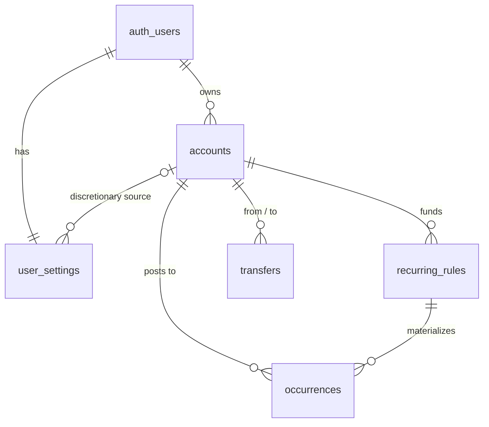

# Database — core domain schema

This document describes the five tables issue #3 added to `public`:
`accounts`, `recurring_rules`, `occurrences`, `transfers`, `user_settings`.
`shared/supabase/database.types.ts` is **generated** from this schema by
`bun run db:types` — this file is the description, that file is the source of
truth for TypeScript. If they disagree, regenerate the types; never hand-edit
them.

The migration is `supabase/migrations/<timestamp>_core_domain_schema.sql`. The
RLS pattern it follows is documented once, canonically, in
[`rls.md`](./rls.md) — this document does not repeat it.

## Entity diagram



`auth_users` is Supabase's `auth.users` — the underscore stands in for the dot
because mermaid treats `.` as a relationship separator.

## Tables

### `accounts`

| column | type | notes |
|---|---|---|
| `id` | `uuid` | PK |
| `user_id` | `uuid` | FK → `auth.users`, cascade delete |
| `name` | `text` | 1–80 chars, trimmed |
| `color` | `text` | `chart-2` / `chart-3` / `chart-4` — a design-token slot, `text` + `check` rather than an enum because the palette can churn. `chart-1` (combined line) and `chart-5` (what-if tint) are never assignable. Mirrors `domain/types.ts` `ACCOUNT_COLORS`. |
| `balance_cents` | `bigint` | signed — an overdrawn account is a real reading |
| `balance_as_of` | `date` | the anchor the projection engine runs forward from |
| `archived_on` | `date`, nullable | null while active; the calendar day the account was archived. See [Archiving, not deleting](#archiving-not-deleting) |

`unique (user_id, id)` is the anchor every child table's composite foreign key
references — see [Cross-user integrity](#cross-user-integrity-composite-foreign-keys)
below. It also serves as the RLS-predicate index, so no separate
`accounts_user_id_idx` exists.

### `recurring_rules`

| column | type | notes |
|---|---|---|
| `id` | `uuid` | PK |
| `user_id`, `account_id` | `uuid` | composite FK → `accounts (user_id, id)`, cascade delete |
| `name` | `text` | 1–80 chars |
| `kind` | `recurring_kind` enum | `bill` \| `income` |
| `amount_cents` | `bigint` | always a positive magnitude; the sign is derived from `kind` when an occurrence is materialized |
| `amount_source` | `recurring_amount_source` enum | `fixed` \| `predicted` — `predicted` is income-only |
| `is_variable` | `boolean` | bill-only presentation marker (a utility bill); the stored amount is still what projection uses |
| `cadence` | `recurring_cadence` enum | `weekly` \| `biweekly` \| `monthly` \| `annual` |
| `anchor_date` | `date` | the rule's first occurrence — which week a biweekly rule falls in, which month-and-day an annual one lands on, and, absent a day set, the weekday or day-of-month everything else aligns to. Nothing is ever projected before it |
| `days_of_month` | `smallint[]`, nullable | monthly only. Days the rule lands on each month; `[1, 15]` is semi-monthly. `-1` is month end. `null` ≠ `{}` — `null` means "the day `anchor_date` names", and the empty array is rejected |
| `days_of_week` | `smallint[]`, nullable | weekly and biweekly only. ISO weekdays, `1` = Monday … `7` = Sunday. Biweekly keeps taking its phase from `anchor_date` |
| `starts_on`, `ends_on` | `date`, nullable | inclusive window bounds; `null` = unbounded in that direction |

Deleting the account a rule belongs to cascades to the rule, and from there to
its occurrences — see [Deletion cascades](#deletion-cascades).

**Cadence is a cycle plus the days inside it.** `cadence` and `anchor_date`
give the cycle — every week, every other week counted from the anchor's week,
every month, every twelfth month. `days_of_month` / `days_of_week` give the days
within it, and are null in the ordinary case, where the anchor names the only
day. There is still no `interval_count` or scalar `weekday` column, and a day
set that does not belong to its cadence is a check violation rather than a
combination the reader has to know to ignore — see [A set of days, not a longer
enum](#a-set-of-days-not-a-longer-enum).

**`anchor_date` is a floor, not merely a phase.** Editing it moves the rule's
own cycle, not just which day-of-month or weekday the cycle lands on — the
engine (`domain/cadence.ts`) never produces a date before it, even while
expanding backwards to fill a chart's look-back window. Without that floor,
moving a monthly rule a whole month (or a weekly rule a whole week) can leave
the projected dates unchanged, because only the day-of-month/weekday component
of the anchor fed the cycle.

This is still not a general-purpose RRULE engine — "the 2nd Tuesday of the
month" is out of scope, by the issue's own words.

### `occurrences`

| column | type | notes |
|---|---|---|
| `id` | `uuid` | PK |
| `user_id`, `account_id` | `uuid` | composite FK → `accounts (user_id, id)`, cascade delete. Denormalized from the rule so the projection index needs no join. |
| `user_id`, `rule_id`, `account_id` | `uuid` | composite FK → `recurring_rules (user_id, id, account_id)`, cascade delete. Includes `account_id` so the denormalized copy cannot disagree with its source — see [Why the rule FK carries account_id](#why-the-rule-fk-carries-account_id) |
| `projected_date` | `date` | written by generation, never by a user — see [The regeneration contract](#the-regeneration-contract) |
| `projected_amount_cents` | `bigint` | signed: income positive, bills negative |
| `actual_date`, `actual_amount_cents` | `date`, `bigint`, both nullable | supersede the projection once the user edits this instance or it happens; a null `actual_date` means "on `projected_date`" |
| `status` | `occurrence_status` enum | `projected` \| `confirmed` \| `skipped` |
| `is_overridden` | `boolean` | true once a single-instance edit has been applied |

`unique (rule_id, projected_date)` is the natural key regeneration upserts on.

### `transfers`

| column | type | notes |
|---|---|---|
| `id` | `uuid` | PK |
| `user_id`, `from_account_id` / `to_account_id` | `uuid` | composite FKs → `accounts (user_id, id)`, cascade delete |
| `amount_cents` | `bigint` | positive; `check` rejects `<= 0` |
| `occurs_on` | `date` | |

`from_account_id <> to_account_id` is a `check` constraint. One row, one
positive amount — see [One row, not two legs](#one-row-not-two-legs).

### `user_settings`

| column | type | notes |
|---|---|---|
| `user_id` | `uuid` | PK **and** FK → `auth.users`, cascade delete — one row per user, structurally |
| `cushion_cents` | `bigint` | default `60000` |
| `monthly_discretionary_cents` | `bigint` | default `0` |
| `time_zone` | `text`, nullable | IANA zone **override**. Null — the default — means follow the device. A browser-resolved zone is never written here; see the migration for why |
| `discretionary_account_id` | `uuid`, nullable | composite FK → `accounts (user_id, id)`, `on delete set null (discretionary_account_id)` — deleting the account nulls only this column, never `user_id` |
| `default_horizon_days` | `smallint` | default `30`; `check` is a sanity range, `1`–`730`. The dashboard's toggle offering 30/60/90 is a fact about that screen, not about the data — see [The horizon is not a menu](#the-horizon-is-not-a-menu) |
| `balance_stale_after_days` | `smallint` | default `14`; `check` is a sanity range, `1`–`365`, in the same spirit as `default_horizon_days`. How old a manually-typed balance anchor may get before the accounts screen flags it |
| `prediction_window` | `smallint` | default `3`; `check` `2`–`12`. How many of a rule's most recent settled occurrences an estimate averages (issue #18). The lower bound is `domain/prediction.ts` `MIN_DEPOSITS_FOR_PREDICTION` — a window of one is a copy, not an estimate. **No screen writes it yet**; see [Estimated amounts](#estimated-amounts) |

`user_id` being the primary key is itself the RLS-predicate index — no
separate `user_settings_user_id_idx`.

### `dashboard_hidden_accounts`

| column | type | notes |
|---|---|---|
| `user_id`, `account_id` | `uuid` | composite PK **and** composite FK → `accounts (user_id, id)`, cascade delete |
| `created_at` | `timestamptz` | default `now()` |

One row per account the user has unchecked in the dashboard's chart legend.
Presence means hidden; absence means shown — see [A hidden set, not a visible
one](#a-hidden-set-not-a-visible-one). `user_id` is the leading column of the
primary key, so that index is the RLS-predicate index; no separate
`dashboard_hidden_accounts_user_id_idx` exists. No `updated_at` and no
trigger: the row's existence is the value, so hiding inserts and showing
deletes rather than either ever updating a row in place.

### `balance_readings`

| column | type | notes |
|---|---|---|
| `id` | `uuid` | PK |
| `user_id`, `account_id` | `uuid` | composite FK → `accounts (user_id, id)`, cascade delete |
| `balance_cents` | `bigint` | signed, same as `accounts.balance_cents` |
| `as_of` | `date` | the day this reading was true |
| `created_at` | `timestamptz` | default `now()` |

`unique (user_id, account_id, as_of)` is the natural key — a day can only have
one true balance — and doubles as the RLS-predicate index, the same shape
`accounts`' own `unique (user_id, id)` takes; no separate
`balance_readings_user_id_idx` exists.

One row per reading an account has since moved past. `accounts.balance_cents`/
`balance_as_of` still holds the *current* reading; this table exists so the
one it replaces is not simply gone. `save_account` and `save_account_balances`
(`supabase/migrations/20260911120500_preserve_superseded_balance_readings.sql`)
both insert the outgoing (`balance_cents`, `balance_as_of`) pair here,
`on conflict do nothing`, immediately before overwriting it — skipped when
neither is actually changing. `domain/projection.ts`'s `readingsFor` merges
this table's rows for an account (kept only for days strictly before its
current `balance_as_of`) with that current reading, oldest first, and
`integrate` walks the chain so that only the very oldest reading is allowed to
back-fill days before it; every later one overwrites forward from its own day
only. See [docs/engine/README.md](../engine/README.md) — "A stored balance is
true *as of* its own day" — for why a single mutable anchor got this wrong: a
new reading's backward walk silently reshaped every day already shown,
whenever the correction did not match what the recurring items alone would
have predicted.

## Design decisions

### Cross-user integrity: composite foreign keys

A plain `references accounts (id)` foreign key is checked as the table owner
and therefore bypasses RLS: user A could insert a rule pointing at user B's
account, and no policy would ever see it happen, because the row is never
read back through a policy-governed role during the check. That is a real
hole against "cross-user access impossible at the data layer."

The fix here: every parent table carries `unique (user_id, id)`, and every
child's foreign key is `foreign key (user_id, child_fk) references parent
(user_id, id)`. Planting a row with `user_id = B` but pointing at an account
owned by A is now a foreign-key violation, not merely a policy denial —
provably so, even from a connection that holds `BYPASSRLS`. See
`tests/rls/domain-tables.test.ts`'s last describe block.

Cost: one extra unique index per parent table, which doubles as its
RLS-predicate index rather than sitting alongside a separate one.

### Why the rule FK carries `account_id`

`occurrences.account_id` is denormalized from the owning rule so the projection
index can be `(user_id, account_id, projected_date)` without a join. A copied
value can drift from its source, so the foreign key includes it:
`(user_id, rule_id, account_id)` references
`recurring_rules (user_id, id, account_id)`, backed by a matching unique key on
the parent.

Without it, reassigning a rule to another account — an ordinary edit — would
leave every existing occurrence pointing at the old account with no error, and
the projection would bill the wrong account while the rule read correctly. With
it, that reassignment is rejected while occurrences exist. Moving a rule between
accounts is a rule split, the same shape as apply-to-future: close the old rule,
open a new one on the new account.

Issue #9's regeneration makes this reachable on the very first save of any
rule — before it, no app-created rule ever had an occurrence, so the
rejection was theoretical. `RecurringItemEditor.vue` now disables the Account
control while editing an existing rule rather than offering an action the
data model has always forbidden; `useRunwayData.ts`'s `saveRecurringItem`
still distinguishes the `23503` (`foreign_key_violation`) error as defence in
depth, for anything that reaches the write some other way. Moving an item
between accounts is unimplemented — it would be this same rule-split shape —
and belongs to its own issue, not this one.

This is the schema's general stance — an invariant a reader has to remember is
not an invariant. Everything else here is structural, and the one denormalized
value is too.

### One row, not two legs

**Settled 2026-08-20.** Issue #3 worded transfers as "two linked legs that net
to zero"; this is the deliberate departure, confirmed rather than assumed.

A transfer is one row — `from_account_id`, `to_account_id`, one positive
`amount_cents` — rather than a parent row plus two signed leg rows. Net-zero
is structural: there is exactly one amount, and the two legs are derived from
it at read time. "Exactly two legs that sum to zero" is not expressible as a
table constraint on a two-row design without a deferred constraint or a
trigger, and is violable between statements even then.

What settled it is what a transfer *is* here. Runway never moves money — it
does not connect to a bank, initiate an ACH, or make anything happen. A
transfer is a **classification**: the user telling Runway that an outflow from
one of their accounts and an inflow to another are the same event, so the
projection must not read it as spending on one side or income on the other.
That is a single fact about a single event, and a single fact belongs in a
single row. Two rows would be two facts that can disagree.

The classification has nowhere else to live today: there is no general
transaction table to tag. `occurrences` are rule-derived bill and income rows,
and a transfer is neither. So `transfers` being its own table *is* the tag, and
keeping it separate is what keeps the projection balance-neutral by
construction rather than by a filter somebody has to remember to apply.

`domain/types.ts`'s `Transfer` made the same call, for the same reason — "the
pair can never drift apart." The transfers screen agreed, before it was
removed (`8ae4b88`, UI-only — this table, its RLS and `domain/transfers.ts`
were untouched): one list row per transfer, one from-swatch → arrow →
to-swatch, one "Transfer" badge — the design followed the one-row shape
because the shape is real, not the other way around.

If a leg ever needs independent state (one side cleared, the other still
pending), that is reconciliation — and it arrives with imported bank
transactions, which is when a general transaction table exists to hold it. Out
of scope here.

### A set of days, not a longer enum

Issue #3's cadence list — weekly, biweekly, monthly, annual — has no room for a
semi-monthly paycheck, and semi-monthly is how a large share of people are
actually paid. The 1st and the 15th is not a cadence the four values can
express, and neither is the 5th and the 20th, or the 1st and month end.

Adding `semimonthly` to the enum would fix exactly one of those. The next
arrangement would be another enum value, another migration, another branch in
the engine — and the enum would slowly become a list of the arrangements
somebody happened to ask for.

So the day set is data instead. `cadence` stays four values and describes the
**cycle**; `days_of_month` / `days_of_week` describe the **days inside it**, and
one rule covers every arrangement of them. `[1, 15]` is semi-monthly with no
vocabulary for it, and `[5, 20]` needs nothing new at all.

Three details make the column safe to read:

- **`null` is not the empty set.** `null` means "the day `anchor_date` names",
  which is the common case and keeps every existing rule correct without a
  backfill. `{}` is rejected: it would mean "no days", which is not a rule.
  The check uses `cardinality`, not `array_length` — `array_length('{}', 1)` is
  `null`, and a check constraint whose expression is `null` **passes**.
- **Order and repetition are not data.** A `before insert or update` trigger
  sorts and de-duplicates, so `{15,1}` and `{1,15,15}` are one stored value.
  A check constraint cannot do this (no subqueries, and `unnest`/`array_agg` is
  the only way to sort an array), hence a trigger.
- **A day set belongs to its cadence.** `days_of_month` on a weekly rule is a
  check violation, not a field the engine quietly ignores.

`-1` means the last day of the month. `31` clamps to month end in the seven
months that have fewer days, but "the 31st, clamped" and "month end, whenever
that falls" are different intents, and only one of them survives being read back.
Days that clamp onto the same date collapse: `[30, 31]` in February is one
occurrence, which is also the only thing `occurrences`' unique key on
`(rule_id, projected_date)` will store. `domain/cadence.ts` does the same, and
`domain/cadence.test.ts` pins it.

### The horizon is not a menu

`default_horizon_days` is bounded at `1`–`730` rather than restricted to the
`(30, 60, 90)` the dashboard toggle offers.

Three enumerated values would encode one screen's current control into the
database, where widening it — a 14-day view, a "rest of the year" view, a
remembered custom horizon — costs a migration and a redeploy. The schema gains
nothing for that price: nothing downstream is made safe by 45 being rejected,
and the toggle constrains its own values in the UI regardless. The range that
remains is a sanity bound, catching `0` and `32767` while staying out of the
way of any horizon a person might actually want.

Issue #12 gives this column its first writer: every click on the dashboard's
30/60/90 toggle persists the choice here, under the column's own name — the
last horizon you chose becomes your *default*. A value the toggle cannot
reach (stored outside `{30, 60, 90}`, unreachable through the UI today) is
still respected verbatim rather than snapped to the nearest menu entry — see
`app/composables/useRunwayData.ts` `setDefaultHorizonDays`.

### A hidden set, not a visible one

`dashboard_hidden_accounts` stores which accounts a user has **unchecked** in
the dashboard's chart legend, not which ones are checked. Three candidates
were weighed for this preference, and the hidden-set join table won:

- **A `uuid[]` column on `user_settings`.** Cheapest — no new table, no
  policies, no grants — and rejected. An array cannot carry the composite
  foreign key [Cross-user integrity](#cross-user-integrity-composite-foreign-keys)
  makes the rule for every other reference in this schema: nothing would stop
  one user's array naming another user's account id, and a deleted account's
  id would dangle in the array forever with no cascade to sweep it.
- **A `show_on_dashboard boolean` column on `accounts`.** No FK problem, and
  cascades and archives for free. Rejected on blast radius rather than
  correctness: a column on `accounts` is a field on `domain/types.ts`
  `Account`, constructed in nineteen files including the seed, the golden
  fixtures, and the `save_account` RPC's signature — and it would put a field
  the projection engine must ignore onto the type the engine consumes. A
  dashboard preference is not worth that ripple.
- **A join table, keyed `(user_id, account_id)`.** Chosen. It matches the
  established pattern in this file exactly, self-cleans via the composite
  FK's `on delete cascade` when an account is deleted, and touches nothing in
  `domain/`.

**Why hidden rather than shown:** the set stored is the one an account is
*absent* from by default. An account created on another screen is not in this
table, so it appears on the chart — visible unless a user explicitly hid it,
never invisible until someone remembers to show it.

### The timezone override has no writer, on purpose

`user_settings.time_zone` is readable, mapped, and resolved
(`override ?? device ?? UTC`), and nothing in the app writes it. That is a
decision, not an unfinished edge.

Following the device is the right default for very nearly everybody: "what day
is it" should track the phone in your hand, not a setting you changed once and
forgot. The override exists for the minority it is wrong for — somebody working
abroad who still budgets on home dates — and for a reason that outlives them:
the answer has to be *storable* to survive the move from browser storage to an
account, and a column added later is a migration plus a backfill, where a column
carried from the start is free.

So the writer waits for the settings screen, which does not exist yet.
`useRunwayData().setTimeZoneOverride` is the seam it will call; it is exercised
by tests and by nothing else, and that is the intended state until then. What
must **not** happen in the meantime is the device-resolved zone being written
into this column as a convenience — that freezes the first device the user ever
opened the app on. See `app/composables/useTimeZone.ts`.

### The regeneration contract

`projected_date` is written by the occurrence generator and never by a user.
That is what makes `(rule_id, projected_date)` a stable natural key even when
a user retimes an occurrence — a retime writes `actual_date`, leaving the key
untouched.

**A row is protected iff `is_overridden` or `status <> 'projected'`.**
Issue #9 implements this with `public.regenerate_occurrences` (`security
invoker`, `supabase/migrations/20260904015555_occurrence_regeneration.sql`),
a single function a caller invokes with the rule ids in scope, a window, and
the desired `(rule_id, projected_date, projected_amount_cents)` set computed
by `domain/materialization.ts`'s `desiredOccurrences` — the engine's own
`occurrenceDates`, never a second cadence expander in SQL. In one transaction
it:

```sql
insert into public.occurrences (user_id, account_id, rule_id, projected_date, projected_amount_cents)
values (...)
on conflict on constraint occurrences_rule_projected_date_key
do update set
  projected_amount_cents = excluded.projected_amount_cents
where not occurrences.is_overridden and occurrences.status = 'projected';
```

and then deletes now-out-of-window, now-undesired rows with the same
predicate as a conjunct, bounded by the window:

```sql
delete from public.occurrences o
 where o.user_id = (select auth.uid())
   and o.rule_id = any (p_rule_ids)
   and o.projected_date between p_window_start and p_window_end
   and not o.is_overridden
   and o.status = 'projected'
   and not exists (select 1 from desired d
                     where d.rule_id = o.rule_id and d.projected_date = o.projected_date);
```

The window bound on the delete is what makes **past occurrences retained as
history** true: a row that has fallen behind the window as `today` advanced
is not in the delete's result set at all, regardless of protection — the
predicate does not merely spare protected rows inside the window, it never
considers rows outside it. `user_id` is derived from `(select auth.uid())`,
never a parameter, so the function cannot act across two users' data in one
call no matter what rule ids a caller names.

**On the issue's wording, precisely.** Issue #9 says "ending or editing a
rule updates only *future* non-overridden occurrences." Regeneration is
actually not future-only: it rewrites and deletes unprotected rows across
the *whole* window, look-back included — a `projected`, non-overridden row
in the past is stale in exactly the same way a future one would be, since it
never actually happened, and the RPC has no reason to treat the two
differently. Only *protection* (`is_overridden`, or `status <> 'projected'`)
is what the wording's "non-overridden" was really pointing at; "future" is
not a second condition this implementation applies.

**The invariant is structural, not just the RPC's own discipline.** A trigger,
`private.protect_materialized_occurrence()` (`before update on
public.occurrences`), independently raises `check_violation` if
`projected_date` ever changes, or if a protected row's
`projected_amount_cents` changes outside this RPC's own guarded path. The
RPC's `where` clauses already exclude those writes, so the trigger costs
nothing on the happy path; it exists so a future writer that reaches around
the RPC gets a loud abort instead of a silent clobber.

**Trigger point: on rule save, plus a client-side horizon top-up.** There is
no scheduler in this project (`no-timed-triggers`), and pure on-read would
make a `GET` perform writes. So regeneration runs from two call sites:
`useRunwayData().saveRecurringItem` regenerates the one saved rule right
after the save that created or changed it, and
`useOccurrenceMaterialization().startHorizonUpkeep()` — installed once in
`app/layouts/default.vue`, client-only — tops up every rule's horizon as
`today` advances or a rule appears that came from outside the app. Both are
harmless to run twice: the upsert's `is distinct from` conjunct on the
amount means an unchanged rule's regeneration is `{ upserted: 0, deleted: 0 }`
and moves no `updated_at`.

**The window: `today - 90` to `today + 365`**
(`domain/materialization.ts` `MATERIALIZATION_LOOKBACK_DAYS` /
`MATERIALIZATION_HORIZON_DAYS`), deliberately not
`user_settings.default_horizon_days` — see
[The horizon is not a menu](#the-horizon-is-not-a-menu): a UI toggle must
never resize what is stored. A rule on an archived account is still
materialized, matching [Archiving, not deleting](#archiving-not-deleting).

**Status vocabulary.** Issue #9's own text describes three states —
`projected` / `overridden` / `settled` — that map onto this schema's actual
columns rather than a new enum:

| issue's word | schema |
|---|---|
| projected | `status = 'projected'` and `is_overridden = false` |
| overridden | `is_overridden = true` — at *any* status |
| settled | `status = 'confirmed'`, which `occurrences_confirmed_has_actual_ck` already forces to carry an `actual_amount_cents` |
| *(no issue word)* | `status = 'skipped'` — this cycle's bill or income cancelled |

`is_overridden` is not folded into the enum because it is not mutually
exclusive with the others: a user can retime a future paycheck (overridden,
still `projected`) or skip a bill deliberately (overridden *and* `skipped`).
The enum stays `('projected', 'confirmed', 'skipped')`, unchanged by this
issue.

**`supabase/seed.sql`'s own occurrence generator is a separate, narrower
code path, deliberately not unified with `regenerate_occurrences`.** It
materializes forward from `greatest(anchor_date, starts_on)` through a fixed
horizon, once, at seed time; the app materializes a whole sliding window in
both directions, repeatedly, as rules change and the calendar advances. They
solve different problems and `tests/rls/seed-fidelity.test.ts` pins the
seed's own exact output, so touching it would churn that test's assertions
for no benefit. (The seed already carries its own comment on why it cannot
use Postgres' `generate_series(..., interval '1 month')` to do it — that
step is sticky, `addMonthsClamped` is not.) One consequence worth knowing:
once the horizon top-up runs against a seeded user's real session — which
happens the moment that user loads an authenticated page — their
`occurrences` rows extend past what the seed alone produced, and
`seed-fidelity`'s exact-match assertion needs a fresh `bun run db:reset` to
hold again. Harmless for CI (`database` and `e2e` are separate jobs, each
starting its own stack from empty); worth knowing when reusing one local
stack across manual suite runs in the wrong order.

**Issue #15 adds the two functions that actually create a protected row on
purpose**, rather than merely respecting one `regenerate_occurrences` already
protects: `public.override_occurrence` and `public.revert_occurrence`
(`supabase/migrations/20260913090000_occurrence_overrides_and_rule_split.sql`).

`override_occurrence(p_rule_id, p_projected_date, p_projected_amount_cents,
p_actual_amount_cents, p_actual_date)` is keyed on the natural key
`(rule_id, projected_date)`, never the row's own uuid — the identifier that
survives materialization lag, since a first-time edit of a date the horizon
top-up has not reached yet still has to land somewhere. If the row exists it
updates `actual_amount_cents` / `actual_date` / `is_overridden = true`; if it
does not, it inserts one with `on conflict on constraint
occurrences_rule_projected_date_key do update`, which is also what makes two
concurrent first-time overrides resolve to one row instead of a duplicate-key
error. Either way it never writes `projected_date` or `projected_amount_cents`
on an existing row, so `private.protect_materialized_occurrence()` never has
occasion to object — including on a *second* edit of an already-overridden
row. Rejects with `PT404` for a foreign or unknown `(rule_id, projected_date)`
and `PT409` for a row whose `status <> 'projected'` (editing a settled
occurrence is reconciliation's concern, #26).

`revert_occurrence(p_rule_id, p_projected_date)` is the inverse: clears
`actual_amount_cents` / `actual_date` to `null` and `is_overridden` to
`false`, restoring the rule's own value as the effective one. Same `PT404`
for not-found, and `PT409` for a settled row — clearing `actual_amount_cents`
on a `confirmed` row would violate `occurrences_confirmed_has_actual_ck`, not
merely be the wrong call.

Both are `security invoker`, derive `user_id` from `(select auth.uid())` and
never accept it as a parameter, and use PostgREST's `PTxyz` `sqlstate`
convention (`raise sqlstate 'PT404' using message = '…'`) so a rejection
carries a distinguishable HTTP status without risking a bare `raise
exception`'s `P0002` → HTTP 500 mapping.

### Settling an occurrence

**Issue #26's manual half** — "Mark as paid" / "Mark as received" in the
day editor — adds the two functions that create and remove a *settled* row:
`public.settle_occurrence` and `public.unsettle_occurrence`
(`supabase/migrations/20260925010000_settle_occurrence.sql`). The other half
of #26, matching imported transactions against occurrences, waits on an
import source (#22, per ADR 0002) and is meant to call these same two
functions rather than a second write path.

`settle_occurrence(p_rule_id, p_projected_date, p_projected_amount_cents,
p_actual_amount_cents, p_actual_date)` sets `status = 'confirmed'` and the
actual amount and date, keyed and inserting exactly as `override_occurrence`
does. It leaves `is_overridden` as it found it. Rejects with `PT400` for a
null date or an amount whose sign contradicts the rule's kind (income `> 0`,
bill `< 0` — anything else would be dropped from the history by
`settledMagnitude` anyway, so it is refused rather than quietly not
counting), `PT404` for a foreign or unknown rule, and `PT409` for a row that
is already settled or skipped: re-settling would overwrite a recorded fact.

`unsettle_occurrence(p_rule_id, p_projected_date)` is the way back ("the
user can always unmatch"): `status` returns to `projected`; a row that was
hand-edited before it was settled keeps its `actual_*` as its edit, and one
that was not has them cleared. `PT404` for not-found, `PT409` for a row that
is not settled. The row is kept either way; the next regeneration owns it
again if nothing protects it.

What a settled row does, without any further mechanism:

- **It is what happened, on the chart.** The overlay read
  (`useRunwayData`) returns `confirmed` rows beside the edited ones, mapped
  to overrides with `settled: true`; the engine applies them like any
  override, marks the occurrence `isSettled`, and lets no later override —
  a what-if preview of that day or an apply-to-future sweep — rewrite it
  (`domain/overrides.ts`).
- **It moves every later estimate.** It is exactly what
  `recent_settled_amounts()` reads, so settling a predicted paycheck or a
  variable bill is what gives the rule its history. That is #26's
  "corrections propagate forward without disturbing history".
- **Regeneration leaves it alone**, because `status <> 'projected'` is
  already half of the protection predicate.

`override_occurrence` and `revert_occurrence` still refuse a settled row
with `PT409`; the day editor shows a settled occurrence as a summary with an
Undo rather than an editable form for that reason.

**A settled row on a rule that is later split at an earlier date** stays on
the closed rule, as the paragraph on protected rows in
[Rule splitting](#rule-splitting) describes for overridden ones, and so
leaves the forecast. Settling is meant for what has already happened, and
splits are made from a date forward, so the two rarely cross; when they do,
the record is kept, not rewritten.

### Rule splitting

Apply-to-future is implemented as a **rule split**: close the existing rule
with `ends_on`, open a new rule at `starts_on`. Occurrence rows are never
bulk-updated — that would lose history and break reconciliation between what
was projected and what a confirmed occurrence actually recorded.

Worked example, from the seed: the Rent rule was `$1,650/mo` through August,
raised to `$1,750/mo` from September on.

| rule | `anchor_date` | `starts_on` | `ends_on` | occurrences produced |
|---|---|---|---|---|
| Rent (closed) | `2026-08-01` | `null` | `2026-08-31` | `2026-08-01` only |
| Rent (new) | `2026-09-01` | `2026-09-01` | `null` | `2026-09-01`, `2026-10-01`, `2026-11-01`, … |

`starts_on` on the new rule equals its `anchor_date` — the window opens
exactly on-cadence, so no partial-month occurrence is produced at the seam.
`domain/cadence.ts` `occurrenceDates` clamps its walk to
`[max(start, startsOn), min(end, endsOn)]` before expanding, so the two rules'
outputs are contiguous and non-overlapping across the split date —
`domain/cadence.test.ts` asserts the exact array on both sides.

**Issue #15's occurrence editor is what actually performs a split**, through
`public.split_recurring_rule(p_rule_id, p_effective_from, p_amount_cents)`
(`supabase/migrations/20260913090000_occurrence_overrides_and_rule_split.sql`).
Amount only — there is no date parameter. Retiming a successor would mean
moving `anchor_date`, and for a rule carrying `days_of_month`/`days_of_week`
the anchor is not what picks the day, so "move it to the 5th" would be
silently ignored for a semi-monthly rule; retiming-forward, if it is ever
wanted, is its own migration.

The function has two branches. When `p_effective_from` falls at or before the
rule's own effective start (`greatest(anchor_date, coalesce(starts_on,
anchor_date))`), nothing precedes the change date, so there is no
predecessor worth keeping: it updates `amount_cents` on the existing rule in
place and returns no successor. Otherwise it closes the rule
(`ends_on = p_effective_from - 1` — *minus one* because both bounds are
inclusive, so `p_effective_from` itself would otherwise let both rules emit
that day) and inserts a successor copying `account_id`, `name`, `kind`,
`cadence`, `days_of_month`, `days_of_week`, and **the closed rule's original
`ends_on`** (read before that column was overwritten), with
`amount_cents = p_amount_cents` and `anchor_date = starts_on = p_effective_from`.

**Both branches pin the amount** (issue #18,
`supabase/migrations/20260924020000_income_prediction.sql`): the in-place
rule and the successor get `amount_source = 'fixed'` and
`is_variable = false`, rather than inheriting them. Apply-to-future is the
user stating the amount from here on; left estimated, the in-place branch —
same rule id, so same settled history — would have the estimate paint over
the figure just typed. The closed predecessor keeps its own flags.

**Occurrence rows are untouched by this function**, on purpose — the split
commits the rule change atomically, and the client is responsible for
`regenerate_occurrences`ing *both* returned rule ids in one call afterward
(`app/composables/useRunwayData.ts` `splitRecurringItem`) so the closed
rule's now-out-of-scope future rows are swept and the successor's rows are
materialized. A protected (overridden) row on the closed rule at a date on or
after the split stays behind as inert history — the engine never expands a
rule past its own `ends_on`, so nothing reads it into a forecast; sweeping it
is left to reconciliation (#26).

Same `security invoker` / `user_id` / `PTxyz` posture as the two functions
above: `PT400` for a non-positive amount, `PT404` for a foreign or unknown
rule id, `PT409` when `p_effective_from` falls after the rule's own `ends_on`.

### Estimated amounts

Issue #18. Predicted income (`amount_source = 'predicted'`) and a variable
bill (`is_variable`) are *estimated*: the engine projects the rounded mean of
the rule's most recent settled amounts — at least two, at most
`prediction_window` — and the rule's own `amount_cents` otherwise
(`domain/prediction.ts`).

- **Settled means `status = 'confirmed'`, and nothing else.** A hand-edited
  but still-`projected` row (`is_overridden`) is a statement about the
  future, not a record of what happened, and a `skipped` row has no amount
  worth averaging.
- **The estimate is live, not stored.** `amount_cents` stays the user's own
  figure — the fallback — and is never overwritten with a mean. Before #18
  the app froze the mean into it at save time, which destroyed the fallback
  the first time it ran.
- **The read is a function, not a table read.**
  `public.recent_settled_amounts()` returns each rule's last N confirmed rows
  (`row_number() over (partition by rule_id order by projected_date desc)`),
  because PostgREST cannot express a per-group limit and an unbounded read of
  every confirmed row would eventually meet `max_rows`. Rows whose sign
  contradicts the rule's kind are filtered *before* ranking, so they cannot
  take a window slot from a valid older amount, and rules that ended more than
  90 days ago are left out, so the rules apply-to-future splits leave behind
  do not grow the result without bound
  (`supabase/migrations/20260924030000_recent_settled_amounts_bounds.sql`).
  The bound is `prediction_window` × (live rules + rules ended in the last 90
  days). `security invoker`,
  no user parameter: RLS on `occurrences` is what scopes it, and
  `tests/integration/income-prediction.test.ts` proves one user's rows never
  reach another's estimate.
- **An override wins.** A single-occurrence override is protected from
  regeneration and applied after expansion, so it replaces the estimate for
  that occurrence; apply-to-future pins the rule (see
  [Rule splitting](#rule-splitting)).
- **`prediction_window`'s writer is the "Estimates" card on `/accounts`**
  (`app/components/accounts/PredictionWindowCard.vue`, through
  `useRunwayData().setPredictionWindow`). No design artifact covers it; it is
  built from the same pieces as the two settings cards beside it. The write
  is followed by a refresh, not an overlay, because the window is applied
  *inside* `recent_settled_amounts()`: widening it needs rows the previous
  read never fetched.
- **History follows the rule id.** A split's successor starts with none of
  its predecessor's settled rows. The split pins the successor to a fixed
  amount (see [Rule splitting](#rule-splitting)), so nothing estimates from
  that empty history unless the user switches the successor back to an
  estimated amount; if they do, it falls back to its own `amount_cents`
  until two occurrences settle.

### Archiving, not deleting

Issue #7 gives the accounts screen a destructive action, and it is **Archive**,
not delete: `accounts.archived_on` records the calendar day an account stopped
being active, and nothing that referenced it — its rules, their occurrences,
its transfer legs — is touched. `accountName(id)` still resolves for an
archived account, and its history is exactly as queryable as it was.

An archived account is required to hold no discretionary designation, because
`user_settings.discretionary_account_id` names a *live* draw source. Deleting
the account already clears the column (`on delete set null
(discretionary_account_id)`, above); archiving is not a delete, so the same
invariant needs its own enforcement, or it would be an invariant a reader has
to remember rather than one the schema holds. `accounts_clear_discretionary_source_on_archive`
is an `after update of archived_on` trigger, firing only on the
`null -> not null` transition, that nulls the column when the account it names
is archived:

```sql
create trigger accounts_clear_discretionary_source_on_archive
  after update of archived_on on public.accounts
  for each row
  when (new.archived_on is not null and old.archived_on is null)
  execute function private.clear_discretionary_source_on_archive();
```

The flag is cleared, never reassigned — leaving a household with no
discretionary source is legal, and silently moving the drain to another
account would be a change the user did not make. The application clears it
too (belt and suspenders); the trigger is what makes forgetting to clear it
*on that transition* impossible.

**What this does and does not guarantee.** The trigger's `when` clause fires
only on the `archived_on` `null -> not null` transition — the moment an active
account *becomes* archived. It says nothing about `discretionary_account_id`
being written to point at an account that is *already* archived: nothing in
the schema stops that `update user_settings set discretionary_account_id = …`
from naming an archived id, because no trigger or constraint watches writes to
that column, only writes to `accounts.archived_on`. That gap is not reachable
from the app today — `useRunwayData`'s `saveAccount` only ever offers an
active account as the discretionary source — but it is not prevented at the
data layer either, and would need a check constraint or a trigger on
`user_settings` (not on `accounts`) if it ever became reachable.

The projection engine enforces the same fact independently: `domain/accounts.ts`
`activeAccounts` filters archived rows out of `RunwayData.accounts` at the
seam, and `domain/projection.ts` `accountsFor` filters them again, so naming an
archived id in `ProjectionWindow.accountIds` cannot resurrect its balance in a
forecast.

### Deletion cascades

Deleting an account cascades to its rules, and from there to its occurrences
— including confirmed ones. This is a deliberate default, not an oversight:
an account that no longer exists cannot fund a rule, and a rule that no
longer exists cannot own an occurrence.

**The application no longer performs this.** The accounts screen archives
(above) rather than deletes, precisely so this cascade is never triggered by
ordinary use. What follows is now the shape of a cascade the *database* still
performs if a row is ever hard-deleted by hand or by a future admin tool — not
a path any screen offers today.

### Domain mapping

The table `domain/*` code should consult when wiring a store to this schema:

| domain | column | note |
|---|---|---|
| `Account.balance` / `.balanceAsOf` | `accounts.balance_cents` / `.balance_as_of` | the *current* reading only |
| `RunwayData.balanceHistory` | `balance_readings` | readings an account has since moved past; `save_account` / `save_account_balances` insert into it before overwriting `accounts.balance_cents`/`.balance_as_of` — see [`balance_readings`](#balance_readings) |
| `Account.isDiscretionarySource` | *derived* | `user_settings.discretionary_account_id = accounts.id` |
| `Account.archivedOn` | `accounts.archived_on` | `null` maps to **absent**, not to `archivedOn: undefined` — see [Archiving, not deleting](#archiving-not-deleting) |
| `RecurringItem.nextOccurrence` | `recurring_rules.anchor_date` | **names differ deliberately**: the domain expands backwards from it too (to fill a chart's look-back), so it is an anchor, not a "next" — but never *before* it, since it is the rule's first occurrence |
| `RecurringItem.daysOfMonth` / `.daysOfWeek` | `recurring_rules.days_of_month` / `.days_of_week` | same numbering on both sides, `-1` = month end, ISO weekdays. Optional in the domain, nullable here — both mean "the day the anchor names" |
| `RecurringItem.depositHistory` | *derived* | `public.recent_settled_amounts()`: each rule's most recent `occurrences.actual_amount_cents where status = 'confirmed'`, at most `user_settings.prediction_window` per rule, oldest first by `projected_date`, turned into magnitudes by the rule's kind (`withSettledHistory`, `app/lib/supabase/occurrences.ts`). No array column — this is why occurrences are materialized. A `confirmed` row comes from `public.settle_occurrence` ("Mark as paid" / "Mark as received", #26's manual half — see [Settling an occurrence](#settling-an-occurrence)); with fewer than two, an estimated rule falls back to its own `amount_cents`. See [Estimated amounts](#estimated-amounts) |
| `useRunwayData` (`HouseholdSettings.predictionWindow`) | `user_settings.prediction_window` | a *stored preference*, not a field on `RunwayData`: the seam applies it when it builds `depositHistory`, and the engine never reads it |
| `Transfer.date` | `transfers.occurs_on` | |
| `Transfer.createdAt` | `transfers.created_at` | epoch ms at the mapping edge; only ever a same-day tie-breaker |
| `RunwayData.safetyCushion` | `user_settings.cushion_cents` | |
| `RunwayData.timeZone` | `user_settings.time_zone` | an override, not the effective zone. `app/composables/useTimeZone.ts` resolves `override ?? device ?? UTC` |
| `RunwayData.monthlyDiscretionarySpend` | `user_settings.monthly_discretionary_cents` | carried across unconverted; the engine divides it by the length of each month — see `domain/discretionary.ts` |
| `useRunwayData().defaultHorizonDays` | `user_settings.default_horizon_days` | a *stored preference*, not a field on `RunwayData` — the projection engine takes the window as a parameter and does not know a "default" exists |
| `useRunwayData().hiddenAccountIds` | `dashboard_hidden_accounts.account_id` | presence in the table means hidden; `RunwayData` carries no field for it either, for the same reason — see [A hidden set, not a visible one](#a-hidden-set-not-a-visible-one) |
| `Occurrence.date` / `.amount` | *derived* | `coalesce(actual_*, projected_*)` |
| `RunwayData.occurrenceOverrides` (`StoredOccurrenceOverride[]`) | `occurrences` rows where `is_overridden = true and status = 'projected'`, written by `public.override_occurrence` / cleared by `public.revert_occurrence`; **and** rows where `status = 'confirmed'`, written by `public.settle_occurrence` / cleared by `public.unsettle_occurrence`, which map to `settled: true` | scope is `'once'` by construction — see [Rule splitting](#rule-splitting) for the other scope, and [Settling an occurrence](#settling-an-occurrence) |
| `Occurrence.isSettled` | *derived* | `status = 'confirmed'`, through the override above |
| `OccurrenceOverride` scope `future` | **a rule split**, via `public.split_recurring_rule` — not an occurrence write | |

## Why `rls_fixture_items` stays

`tests/rls/helpers.ts` exports `FIXTURE_TABLE`, and `unauthenticated.test.ts`,
`cross-user-isolation.test.ts` and `negative-control.test.ts` are all built on
it. The negative control specifically needs a table whose policies can be
loosened and restored mid-suite; doing that to `accounts` would mean mutating
a real domain table's policy set while other assertions run against it in the
same file. One inert, content-free fixture table is far cheaper than
rewriting four files. `tests/rls/domain-tables.test.ts` covers the five
domain tables directly and is not a replacement for the fixture suite.

## Deliberately absent

- Transaction categories, budgets.
- Credit-card accounts as first-class entities — card payments are ordinary
  bills for now.
- Multi-currency.
- One-off occurrences without a rule: `occurrences.rule_id` is `not null`.
  Dropping that constraint is a one-line forward migration, when imports land.
- A `transfer_legs` view. Two legs are a projection-time property of one row
  — see [One row, not two legs](#one-row-not-two-legs) — not a second table.

## See also

- [`rls.md`](./rls.md) — the RLS pattern every table here follows, and why
  each part of it is the way it is.
- [`local-development.md`](./local-development.md) — the local workflow:
  `db:reset`, `db:types`, `test:rls`.
